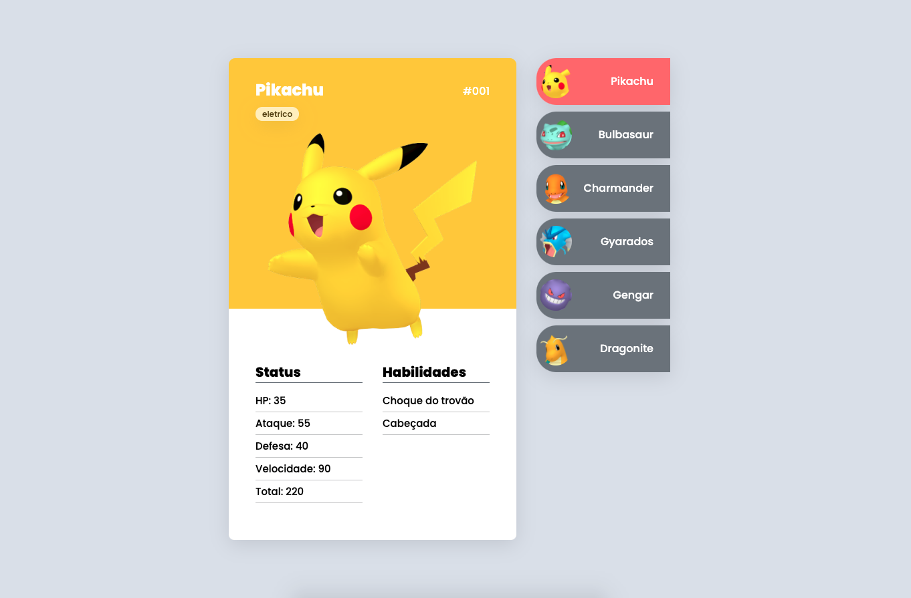

## 🚀 Tecnologias

Este projeto foi desenvolvido com as seguintes tecnologias:

- HTML
- CSS
- JavaScript

<h5 align="center"><a href="https://rakelmm.github.io/pokedex/">ACESSE AQUI O PROJETO FINAL</a></h5>

 

---

Feito com ❤️ por Rakel Moreira.
